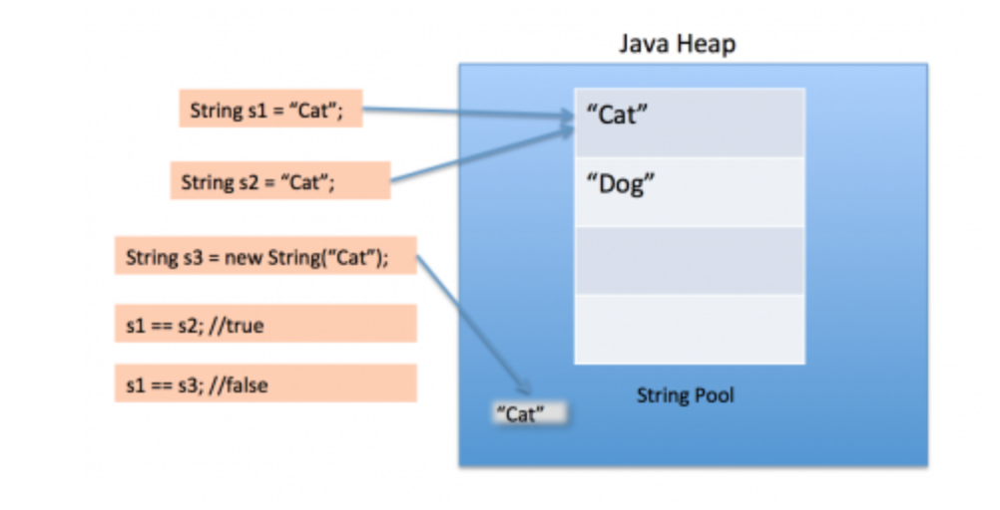

Flyweight design pattern is used when we need to create a lot of Objects of class. Since every object consumes memory
space that can be curial(önemli ölçüde) for low memory devices, such as mobile device or embedded systems, flyweight
design pattern can be applied to reduce the load on memory by sharing objects.

Before we apply flyweight design pattern, we need to consider following factors.
   
   - The number of Objects to be created by application should be huge
   - The object creation is heavy on memory and it can be time consuming too
   - The object properties can be divided into intrinsic(içsel) and extrinsic(dışsal) properties of an 
   Object should be defined by the client program.

To apply flyweight pattern, we need to divide Object property into intrinsic and extrinsic properties. Intrinsic 
properties make to Object unique whereas extrinsic properties are set by client code and used to perform different 
operations. For example, an Object Circle can have extrinsic properties such as color and width.

### What is Java String Pool?

As the name suggests, String Pool in Java is a pool of String Stored in Java Heap Memory. We know that String is special
class in java and we can create String Object using new operator as well as providing values in double quotes.

#### String Pool in Java

Here is a diagram which clearly explains how String Pool is maintained in java heap space and what happens when we use different ways to create Strings.

String Pool is possible only because String is immutable in Java and it is implementation of String interning concept.
String pool is also Flyweight Design Pattern.

#### String intern Wiki

In computer science, string interning is a method of storing only one copy of each distinct string value, which must be immutable.
Interning strings makes some string processing tasks more time- or space-efficient at the cost of requiring more time when the string is created or interned. 
The distinct values are stored in a string intern pool.

The single copy of each string is called its intern and is typically looked up by a method of the string class, for example String.intern() in Java. 
All compile-time constant strings in Java are automatically interned using this method.

